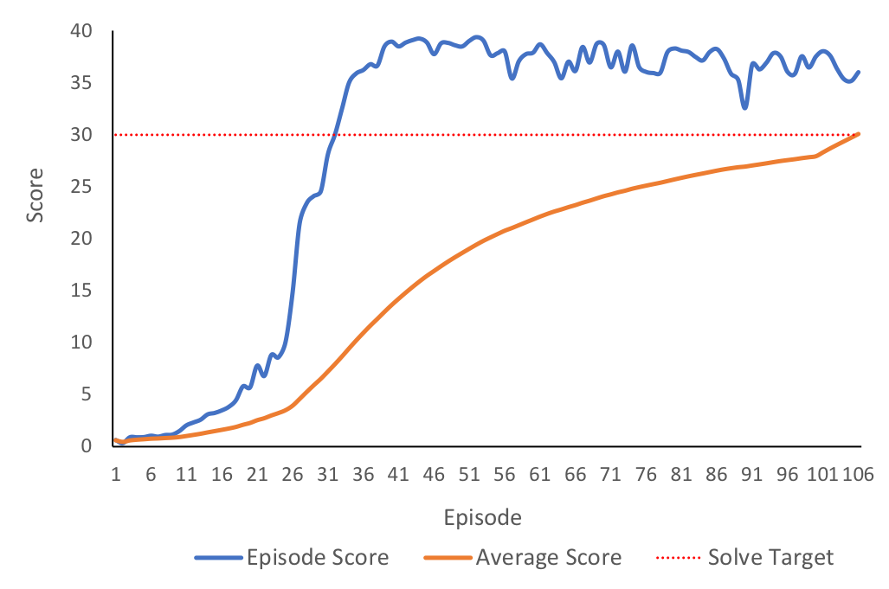

# DDPG (Actor-Critic) Reinforcement Learning using PyTorch and Unity ML-Agents
A simple example of how to implement vector based DDPG using PyTorch and a ML-Agents environment.

The repository includes the following files:
- ddpg_agent.py -> ddpg-agent implementation
- replay_buffer.py -> ddpg-agent's replay buffer implementation
- model.py -> example PyTorch Actor and Critic neural networks
- train.py -> initializes and implements the training processes for a DDPG-agent.
- test.py -> testes a trained DDPG-agent

The repository also includes links to the Mac/Linux/Windows versions of a simple Unity environment, *Reacher*, for testing.
This Unity application and testing environment was developed using ML-Agents Beta v0.4. The version of the Banana environment employed for this project was developed for the Udacity Deep Reinforcement Nanodegree course. For more information about this course visit: https://www.udacity.com/course/deep-reinforcement-learning-nanodegree--nd893

The files in the python/. directory are the ML-Agents toolkit files and dependencies required to run the Reacher environment.
For more information about the Unity ML-Agents Toolkit visit: https://github.com/Unity-Technologies/ml-agents

## Example Unity Environment - Banana's
The example uses a modified version of the Unity ML-Agents Reacher Example Environment.
The environment includes In this environment, a double-jointed arm can move to target locations. 
A reward of +0.1 is provided for each step that the agent's hand is in the goal location. 
Thus, the goal of your agent is to maintain its position at the target location for as many 
time steps as possible. The environment uses multiple unity agents to increase training time.

### Multiagent Traning
The reacher environment contains multiple unity agents to increase training time.
The training agent collects observations and learns from the experineces of all 
of the unity agents simultaneously. The reacher enviromnet example employed here 
has 20 unity agents (i.e., 20 double-jointed arms).

### State and Action Space
The observation space consists of 33 variables corresponding to
position, rotation, velocity, and angular velocities of the arm. 
Each action is a vector with four numbers, corresponding to torque 
applicable to two joints. Every entry in the action vector should 
be a number between -1 and 1. 

## Installation and Dependencies
1. Anaconda Python 3.6: Download and installation instructions here: https://www.anaconda.com/download/

2. Create (and activate) a new conda (virtual) environment with Python 3.6.
	- Linux or Mac:
	
		`conda create --name yourenvnamehere python=3.6`
	
		`source activate yourenvnamehere`

	- Windows:
	
		`conda create --name yourenvnamehere python=3.6`
	
		`activate yourenvnamehere`

3. Download and save this GitHub repository.

4. To install required dependencies (torch, ML-Agents trainers (v.4), etc...)
	- Naviagte to where you downloaded and saved this GitHub repository (e.g., *yourpath/thisgithubrepository*) 
	- Change to the '.python/' subdirectory and run from the command line:
	
		`pip3 install .`

	- Note: depdeing on your system setup, you may have to install PyTorch separatetly. 
		
## Download the Unity Environment
For this example project, you will not need to install Unity - this is because you can use a version of the Banana's unity environment that is already built (compiled) as a standalone application. 

Download the relevant environment zip file from one of the links below. You need only to download the environment that matches your operating system:

- Linux: [click here](https://s3-us-west-1.amazonaws.com/udacity-drlnd/P2/Reacher/Reacher_Linux.zip)
- Mac OSX: [click here](https://s3-us-west-1.amazonaws.com/udacity-drlnd/P2/Reacher/Reacher.app.zip)
- Windows (32-bit): [click here](https://s3-us-west-1.amazonaws.com/udacity-drlnd/P2/Reacher/Reacher_Windows_x86.zip)
- Windows (64-bit): [click here](https://s3-us-west-1.amazonaws.com/udacity-drlnd/P2/Reacher/Reacher_Windows_x86_64.zip)

After you have downloaded the relevant zip file, navigate to where you downloaded and saved this GitHub repository and place the file in the main folder of the repository, then unzip (or decompress) the file.

NOTE: The Reacher environment is similar to, but not identical to the Reacher Collector environment on the Unity ML-Agents GitHub page. 

## Training
 - activate the conda environment you created above
 - change the directory to the 'yourpath/thisgithubrepository' directory.
 - open `train.py`, find STEP 2 (lines 47 to 54) and set the relevant version of Reacher to match your operating system.
 - run the following command:
 
 	`python train.py`
	
 - training will complete once the agent reaches *solved_score* in `train.py`.
 - after training a *ddpgActor_Model_datetime.path* and *ddpgCritic_Model_datetime.path* files will be saved with the trained model weights
 - a *ddpgAgent_scores_datetime.csv* file will also be saved with the scores received during training. You can use this file to plot or assess training performance (see below figure).
 - It is recommended that you train multiple agents and test different hyperparameter settings in `train.py` and `ddpg_agent.py`.
 - For more information about the DDPG training algorithm and the training hyperparameters see the included `Report.pdf` file.

 

## Testing
 - activate the conda environment you created above
 - change the directory to the 'yourpath/thisgithubrepository' directory.
 - run the following command:
 
 	`python test.py`
	
 - An example model weights files are included in the repository (*ddpgActor_Model.pth* and *ddpgCritic_Model.pth*).
 - A different model weights file can be tested by changing the model file name defined in `test.py`.
